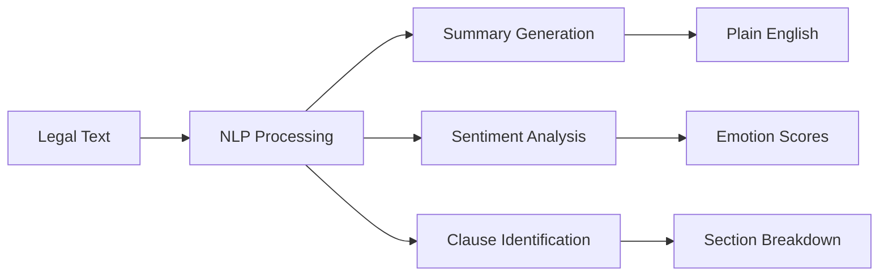
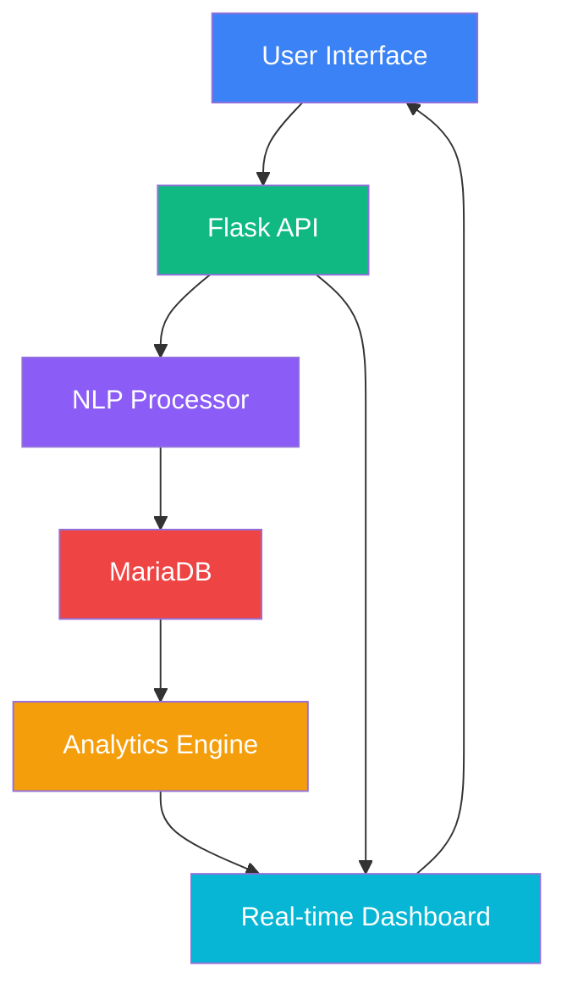

# 🗳️ Polis - Democracy, Decoded

<div align="center">

**Intelligent legislation analysis meets citizen empowerment - Version 1.0**
[](https://python.org)
[](https://flask.palletsprojects.com/)
[](https://mariadb.org)
[]()
[](LICENSE.md)

**Transform complex legislation into accessible insights with AI-powered analysis**

[🚀 Quick Start](#-quick-start-guide) • [📖 Documentation](#-core-features) • [🤝 Contributing](#-contributing)

</div>

## ✨ What is Polis?

<div align="center">

| Before Polis | After Polis |
|--------------|-------------|
| ❌ 200-page legal documents | ✅ 3-sentence AI summaries |
| ❌ Unstructured comments | ✅ Quantifiable sentiment data |
| ❌ Complex legal jargon | ✅ Plain English insights |
| ❌ Limited citizen input | ✅ Structured feedback system |

</div>

Polis is a civic engagement platform that bridges the gap between complex legislation and everyday citizens. Our AI-powered system transforms legal documents into understandable insights, enabling meaningful democratic participation.

## 🎯 Version 1.0 Highlights

<div align="center">

### 🏆 Production Ready & Fully Functional

| Feature | Status | Impact |
|---------|--------|--------|
| Legislation Management | ✅ **Live** | Track active bills |
| AI-Powered Summaries | ✅ **Live** | Understand complex texts |
| Real-time Analytics | ✅ **Live** | See public sentiment |
| Feedback System | ✅ **Live** | Voice your opinion |

</div>

## 🚀 Core Features

### 📋 Intelligent Legislation Hub

<div align="center">


</div>

- **🔍 Smart Search** - Find bills by topic, status, or keywords
- **📖 AI Summarization** - Convert legal text to plain English automatically
- **🎯 Clause Breakdown** - Analyze legislation section by section
- **📊 Progress Tracking** - Monitor bill status and updates

### 💬 Structured Feedback System

<div align="center">

| Feature | Description | Benefit |
|---------|-------------|---------|
| 🎚️ **Sentiment Sliders** | -1 to +1 scoring | Quantifiable feedback |
| 🏷️ **Smart Tagging** | Categorize concerns | Organized input |
| 💭 **Detailed Comments** | Optional text feedback | Nuanced opinions |
| 👥 **Demographic Options** | Age/location data | Contextual insights |

</div>

### 📊 Real-time Civic Analytics

```python
# Live sentiment tracking
sentiment_data = {
    "support": 65.2,      # Percentage in favor
    "oppose": 22.1,       # Percentage against
    "neutral": 12.7,      # Undecided/neutral
    "total_responses": 1247,
    "trend": "increasing" # Support direction
}
```

### 🤖 Advanced NLP Engine

<div align="center">



</div>

## 🛠️ Technology Stack

### Frontend Architecture
<div align="center">

| Layer | Technology | Purpose |
|-------|------------|---------|
| **🎨 Presentation** | Tailwind CSS 3.x | Modern, responsive UI |
| **⚡ Interactivity** | Vanilla ES6+ | Fast client-side logic |
| **📊 Visualization** | Chart.js 3.x | Real-time data charts |
| **🔧 Icons** | Feather Icons | Consistent iconography |

</div>

### Backend Infrastructure
<div align="center">

| Component | Technology | Role |
|-----------|------------|------|
| **🐍 API Server** | Flask 2.3+ | RESTful endpoints |
| **🧠 AI Engine** | NLTK/TextBlob | NLP processing |
| **💾 Database** | MariaDB 10.6+ | Data persistence |
| **🛡️ ORM** | SQLAlchemy 3.0+ | Database management |

</div>

## ⚡ Quick Start Guide

### 🗄️ Step 1: Database Setup

```bash
# Create database and user
mysql -u root -p << EOF
CREATE DATABASE polis_db;
CREATE USER 'polis_user'@'localhost' IDENTIFIED BY 'polis_password';
GRANT ALL PRIVILEGES ON polis_db.* TO 'polis_user'@'localhost';
FLUSH PRIVILEGES;
EOF
```

### 🔧 Step 2: Backend Installation

```bash
# Clone and setup
git clone https://github.com/your-org/polis.git
cd backend

# Create virtual environment
python -m venv venv
source venv/bin/activate  # Windows: venv\Scripts\activate

# Install dependencies
pip install -r requirements.txt

# Initialize database
python setup_database.py

# Start server
python app.py
```

### 🎨 Step 3: Frontend Launch

```bash
# New terminal window
cd frontend
python -m http.server 8000
```

### ✅ Step 4: Verify Installation

<div align="center">

| Check | URL | Expected Result |
|-------|-----|-----------------|
| **Backend API** | `http://localhost:5000/api/v1/legislation` | JSON legislation list |
| **Frontend App** | `http://localhost:8000` | Polis web interface |
| **Database** | MySQL connection | Active polis_db |

</div>

## 📚 API Documentation

### Core Endpoints Overview

| Method | Endpoint | Description | Example |
|--------|----------|-------------|---------|
| `GET` | `/api/v1/legislation` | List bills | `?status=active&page=1` |
| `GET` | `/api/v1/legislation/{id}` | Bill details | Includes clauses |
| `POST` | `/api/v1/feedback` | Submit feedback | JSON payload |
| `GET` | `/api/v1/civic-pulse/{id}` | Analytics data | Sentiment breakdown |

### Example Usage

```javascript
// Submit structured feedback
const feedback = {
    legislation_id: 42,
    sentiment_score: 0.8,
    tags: ["#Environment", "#Positive"],
    comment: "Great step for climate action!",
    demographic_data: {
        age_group: "25-35",
        location: "Metro Area"
    }
};

// API call
const response = await fetch('/api/v1/feedback', {
    method: 'POST',
    headers: {'Content-Type': 'application/json'},
    body: JSON.stringify(feedback)
});
```

## 🏗️ System Architecture

### Data Flow Diagram

<div align="center">



</div>

### Component Interaction

```python
# Example workflow
class PolisWorkflow:
    def process_legislation(self, legal_text):
        summary = nlp_processor.summarize(legal_text)
        clauses = nlp_processor.extract_clauses(legal_text)
        return {
            'summary': summary,
            'clauses': clauses,
            'sentiment_score': nlp_processor.analyze_sentiment(legal_text)
        }
```

## 📊 Demo Data Included

Version 1.0 comes with sample legislation to test immediately:

<div align="center">

| Bill ID | Title | Category | Status |
|---------|-------|----------|--------|
| **SB-42** | Climate Resilience Act | Environment | 🟢 Active |
| **HB-15** | Affordable Housing Act | Urban Development | 🟡 Review |
| **AB-07** | Digital Privacy Act | Technology | 🔴 Draft |

</div>

## 🚀 Deployment Options

### Development (Recommended for Start)

```yaml
# docker-compose.yml (Simplified)
version: '3.8'
services:
  backend:
    build: ./backend
    ports: ["5000:5000"]
  
  frontend:
    build: ./frontend  
    ports: ["8000:8000"]
  
  database:
    image: mariadb:10.6
    environment:
      MYSQL_DATABASE: polis_db
```

### Production Environments

| Platform | Setup Time | Cost | Recommendation |
|----------|------------|------|----------------|
| **AWS EC2** | 30 minutes | $$$ | Enterprise scale |
| **DigitalOcean** | 15 minutes | $$ | Startup friendly |
| **Heroku** | 10 minutes | $ | Rapid deployment |

## 🔮 Future Roadmap

### Phase 2: Enhanced Engagement (Q1 2024)

<div align="center">

| Feature | Status | ETA |
|---------|--------|-----|
| 🔐 User Authentication | 🟡 Planning | Q1 2024 |
| 📱 Mobile App | 🟡 Research | Q2 2024 |
| 🎯 Advanced NLP | 🔬 Research | Q3 2024 |
| 🌍 Multi-language | 💭 Future | Q4 2024 |

</div>

### Phase 3: Advanced Features

- **Predictive Analytics** - ML models for policy impact
- **Geographic Heatmaps** - Regional sentiment visualization  
- **Blockchain Verification** - Immutable feedback records
- **Government API Integration** - Direct legislative data feeds

## 🤝 Contributing

We welcome contributions from developers, designers, and civic technology enthusiasts!

### How to Contribute

1. **Fork the Repository**
   ```bash
   git clone https://github.com/your-org/polis.git
   ```

2. **Choose an Area**
   - 🎨 **Frontend**: UI/UX improvements
   - ⚙️ **Backend**: API enhancements  
   - 🧠 **AI/ML**: Advanced NLP models
   - 📊 **Analytics**: Data visualization

3. **Submit Pull Request**
   ```bash
   git checkout -b feature/amazing-improvement
   git commit -m "Add amazing improvement"
   git push origin feature/amazing-improvement
   ```

### Development Focus Areas

| Priority | Area | Description |
|----------|------|-------------|
| 🟢 High | Performance | Faster load times, optimized queries |
| 🟢 High | Accessibility | WCAG compliance, screen readers |
| 🟡 Medium | Testing | Unit tests, integration tests |
| 🟡 Medium | Documentation | API docs, user guides |

## 🐛 Troubleshooting

### Common Issues & Solutions

<div align="center">

| Problem | Solution | Command |
|---------|----------|---------|
| Database Connection | Check MySQL service | `sudo systemctl status mysql` |
| Python Dependencies | Recreate venv | `pip install -r requirements.txt` |
| CORS Errors | Verify backend config | Check `CORS(app)` in `app.py` |
| Port Conflicts | Use different ports | Change 5000/8000 in config |

</div>

### Debugging Tools

```python
# Enable debug mode
export FLASK_DEBUG=1
python app.py

# Test API endpoints
python test_api.py

# Check database
mysql -u polis_user -p polis_db -e "SHOW TABLES;"
```

## 🔒 Security & Privacy

### Current Protections

- ✅ **SQL Injection Prevention** - ORM-based queries
- ✅ **Input Validation** - Frontend and backend checks
- ✅ **CORS Configuration** - Controlled cross-origin requests
- ✅ **Data Encryption** - Secure database connections

### Privacy Features

- 🔒 Anonymous participation option
- 🔒 Optional demographic data
- 🔒 No personal identification required
- 🔒 Data aggregation for analytics

## 📄 License

<div align="center">

## License

This project is licensed under the [Creative Commons Attribution-NonCommercial 4.0 International License](http://creativecommons.org/licenses/by-nc/4.0/).

[](http://creativecommons.org/licenses/by-nc/4.0/)

You are free to:
- Use and modify for **personal/educational purposes**
- Share with proper **attribution**

**Commercial use requires explicit permission.**

</div>

## 🌟 Acknowledgments

Polis Version 1.0 is made possible by these amazing technologies and communities:

<div align="center">

| Technology | Contribution |
|------------|-------------|
| **Flask** | Lightweight web framework |
| **MariaDB** | Robust database solution |
| **Tailwind CSS** | Modern UI components |
| **NLTK/TextBlob** | NLP capabilities |

**Special thanks to the open-source community and civic technology advocates worldwide.**

</div>

---

<div align="center">

## 🗳️ Ready to Transform Democracy?

**Start exploring legislation today and make your voice heard!**

[🚀 Quick Start](#-quick-start-guide) • [📖 Documentation](#-core-features) • [🐛 Issues](https://github.com/your-org/polis/issues)

**Polis Version 1.0 - Making democratic participation accessible and meaningful.**

*For support and collaboration: Open an issue or contact our team.*

</div>

---

<div align="center">

*Last updated: January 2024 | Version 1.0 | [View Changelog](CHANGELOG.md)*


</div>
